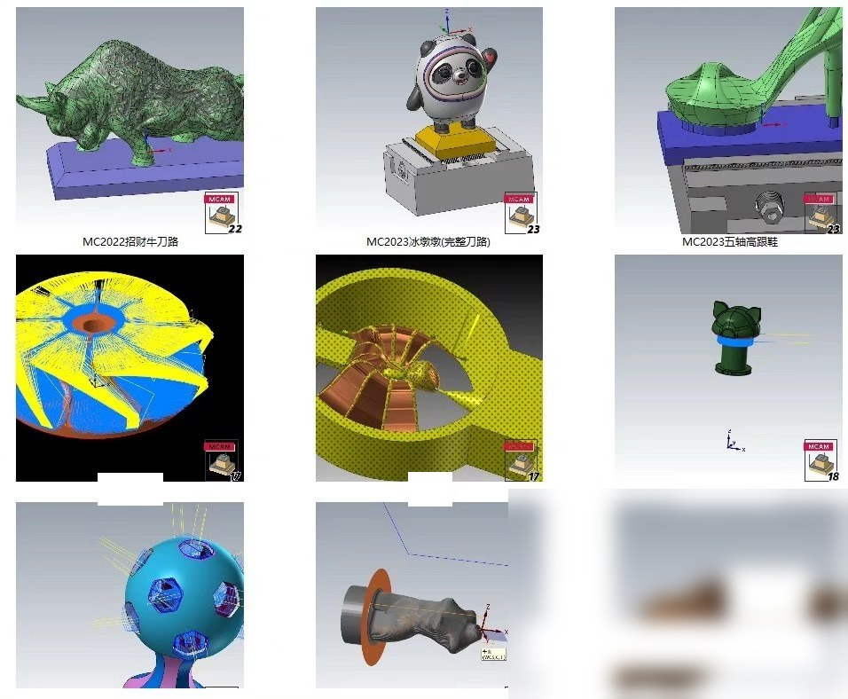
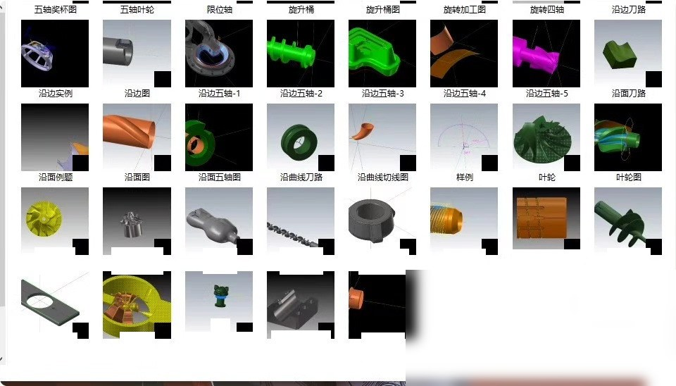
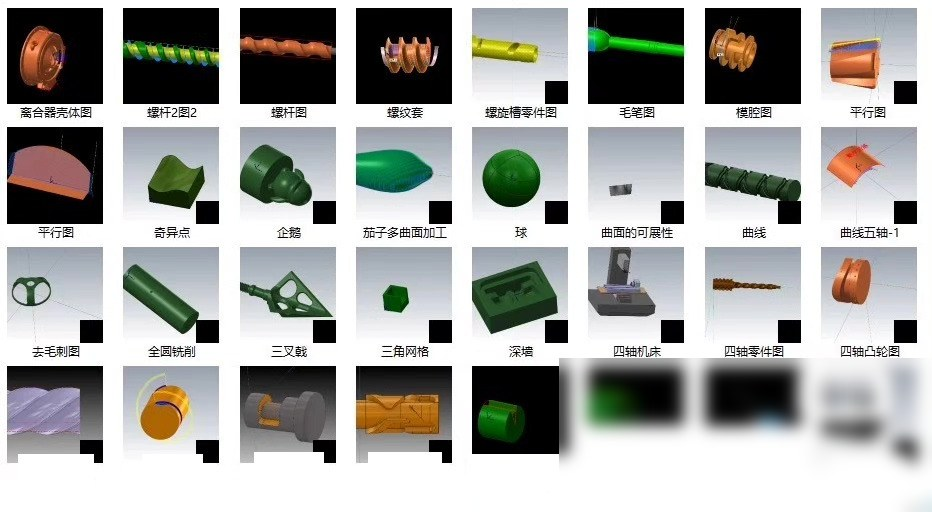
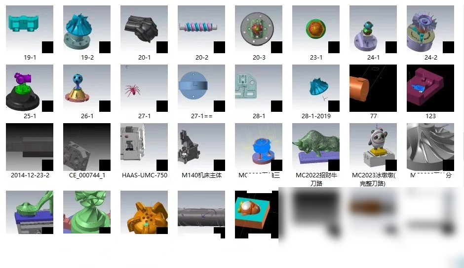
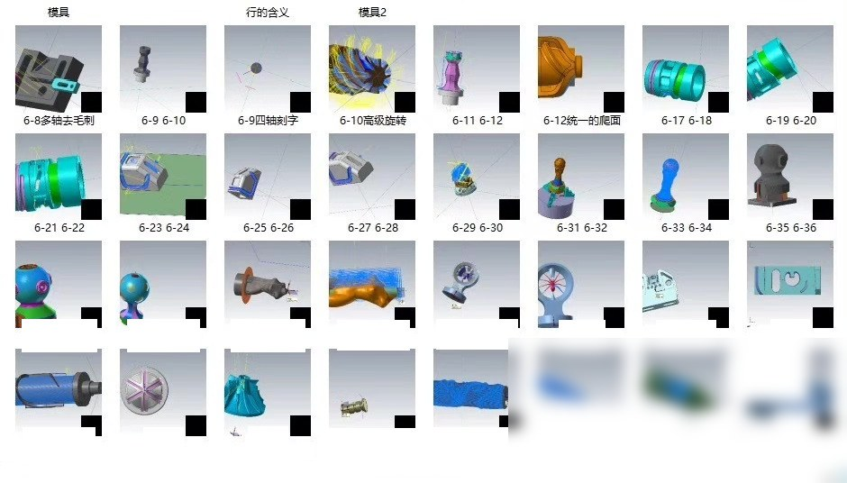
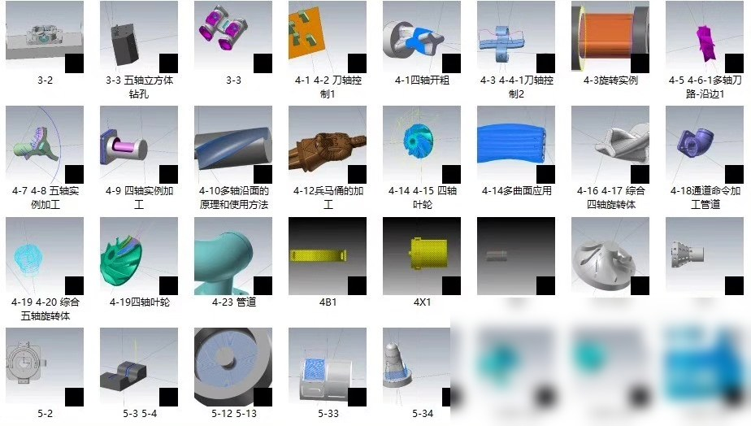
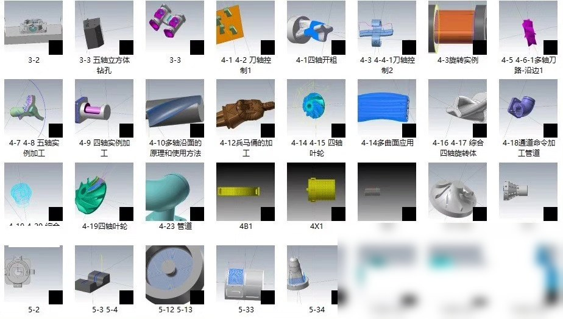
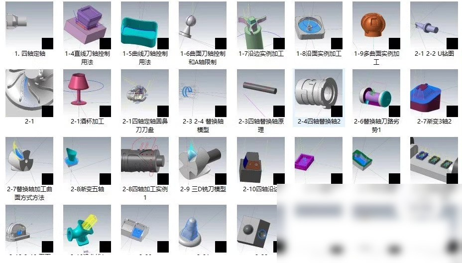

# Mastercam is a popular 3D computer-aided design (CAD) software used for creating 3D models designing parts and generating tool paths. It is widely used in the manufacturing industry for machining complex parts.

In Mastercam, there are two types of tool paths: single-axis tool paths and multi-axis tool paths. Single-axis tool paths are used for cutting one axis at a time, while multi-axis tool paths are used for cutting multiple axes simultaneously.

To create a Mastercam tool path, you need to follow these steps

1. Open the Mastercam software and open your project file.
2. Select the part you want to machine from the model library or import it from another file.
3. Click on the "Tool Path" tab in the ribbon menu.
4. Click on the "Create Tool Path" button.
5. In the "Create Tool Path" dialog box, select the type of tool path you want to create (single-axis or multi-axis).
6. If you want to create a multi-axis tool path, you need to select the number of axes you want to cut simultaneously. You can do this by clicking on the "Axis" drop-down menu and selecting the number of axes you want to cut.
7. Once you have selected the number of axes, click on the "OK" button to continue.
8. The software will generate the tool path for you. You can then save the tool path as a separate file or use it directly in the software.

Here are some examples of Mastercam tool path files

Single-axis tool path
```
M01_A
G00 Z0
G01 X0 Y0 F100
G01 X10 Y10 F100
G01 X20 Y20 F100
G01 X30 Y30 F100
G01 X40 Y40 F100
G01 X50 Y50 F100
G01 X60 Y60 F100
G01 X70 Y70 F100
G01 X80 Y80 F100
G01 X90 Y90 F100
G01 X100 Y100 F100
G01 X110 Y110 F100
G01 X120 Y120 F100
G01 X130 Y130 F100
G01 X140 Y140 F100
G01 X150 Y150 F100
G01 X160 Y160 F100
G01 X170 Y170 F100
G01 X180 Y180 F100
G01 X190 Y190 F100
G01 X200 Y200 F100
```

Multi-axis tool path
```
M01_A
G00 Z0
G01 X0 Y0 F100
G01 X1 Y1 F100
G01 X2 Y2 F100
G01 X3 Y3 F100
G01 X4 Y4 F100
G01 X5 Y5 F100
G01 X6 Y6 F100
G01 X7 Y7 F100
G01 X8 Y8 F100
G01 X9 Y9 F100
G01 X10 Y10 F100
G01 X11 Y11 F100
G01 X12 Y12 F100
G01 X13 Y13 F100
G01 X14 Y14 F100
G01 X15 Y15 F100
G01 X16 Y16 F100
G01 X17 Y17 F100
G01 X18 Y18 F100
G01 X19 Y19 F100
G01 X20 Y20 F100
```

These are just examples, and the actual tool path files may vary depending on the specific requirements of your project.

# Body

Mastercam is a popular 3D computer-aided design (CAD) software used for creating 3D models, designing parts, and generating tool paths. It is widely used in the manufacturing industry for machining complex parts.

In Mastercam, there are two types of tool paths: single-axis tool paths and multi-axis tool paths. Single-axis tool paths are used for cutting one axis at a time, while multi-axis tool paths are used for cutting multiple axes simultaneously.

To create a Mastercam tool path, you need to follow these steps

1. Open the Mastercam software and open your project file.
2. Select the part you want to machine from the model library or import it from another file.
3. Click on the "Tool Path" tab in the ribbon menu.
4. Click on the "Create Tool Path" button.
5. In the "Create Tool Path" dialog box, select the type of tool path you want to create (single-axis or multi-axis).
6. If you want to create a multi-axis tool path, you need to select the number of axes you want to cut simultaneously. You can do this by clicking on the "Axis" drop-down menu and selecting the number of axes you want to cut.
7. Once you have selected the number of axes, click on the "OK" button to continue.
8. The software will generate the tool path for you. You can then save the tool path as a separate file or use it directly in the software.

Here are some examples of Mastercam tool path files

Single-axis tool path
```
M01_A
G00 Z0
G01 X0 Y0 F100
G01 X10 Y10 F100
G01 X20 Y20 F100
G01 X30 Y30 F100
G01 X40 Y40 F100
G01 X50 Y50 F100
G01 X60 Y60 F100
G01 X70 Y70 F100
G01 X80 Y80 F100
G01 X90 Y90 F100
G01 X100 Y100 F100
G01 X110 Y110 F100
G01 X120 Y120 F100
G01 X130 Y130 F100
G01 X140 Y140 F100
G01 X150 Y150 F100
G01 X160 Y160 F100
G01 X170 Y170 F100
G01 X180 Y180 F100
G01 X190 Y190 F100
G01 X200 Y200 F100
```

Multi-axis tool path
```
M01_A
G00 Z0
G01 X0 Y0 F100
G01 X1 Y1 F100
G01 X2 Y2 F100
G01 X3 Y3 F100
G01 X4 Y4 F100
G01 X5 Y5 F100
G01 X6 Y6 F100
G01 X7 Y7 F100
G01 X8 Y8 F100
G01 X9 Y9 F100
G01 X10 Y10 F100
G01 X11 Y11 F100
G01 X12 Y12 F100
G01 X13 Y13 F100
G01 X14 Y14 F100
G01 X15 Y15 F100
G01 X16 Y16 F100
G01 X17 Y17 F100
G01 X18 Y18 F100
G01 X19 Y19 F100
G01 X20 Y20 F100
```

These are just examples, and the actual tool path files may vary depending on the specific requirements of your project.

# Images










# Payment

Here is a pay link on Stripe ( https://buy.stripe.com/3cs8yP7sY87d0vu9AB ). Please contact me lonlonago@foxmail.com after funding $89, and I will send you a complete data files , thank you


Computer vision/deep learning algorithm services primarily focus on areas such as object detection, image segmentation, multimodal analysis, defect detection, face recognition, OCR, medical image analysis, autonomous driving perception, video understanding, behavior recognition, point cloud processing, image enhancement and restoration, image retrieval, and motion prediction.
Communication can be conducted based on specific tasks: model replication, algorithm optimization, performance improvement, model modification, code interpretation/code analysis, data processing, environment configuration, parameter tuning, experimental design, and result analysis, etc.
Core direction overview:
1. Object detection/tracking
Object detection, salient object detection, keypoint detection, lane line detection, point cloud object detection, point cloud segmentation, object tracking, motion detection, motion prediction.
2. Image segmentation/reconstruction
Image segmentation, semantic segmentation, medical image segmentation, geographic information segmentation, remote sensing data segmentation, 3D reconstruction, super-resolution reconstruction, point matching.
3. Face recognition/OCR/Industrial inspection
Face recognition, face detection, mask detection, license plate recognition, text recognition, OCR, defect detection, industrial inspection, anomaly detection.
4. Video understanding/behavior recognition
Video understanding, behavior recognition, pose estimation, gesture recognition, fight recognition, depth estimation, and autonomous driving perception.
5. Image enhancement/restoration
Image dehazing, image deraining, denoising, defogging, image restoration, and image compression.
6. Multimodal/large model related
The directions of multimodal, large model fine-tuning, algorithm analysis, and joint image-text representation are communicable.
Technology stack:
Inference frameworks: TensorRT, ONNX, OpenVINO
Common models/directions: YOLO, GAN, VIT, SLAM, diffusion models, etc. Discussions can be held based on project requirements.
Application fields:
For applications such as street view, medicine, remote sensing, daily scenes, industrial inspection, autonomous driving, and biomedical imaging, we can first discuss the specific requirements.
Individual work, suitable for developers with experience in computer vision, deep learning, algorithm replication, model optimization, code development, and project requirements.
The price is determined based on the difficulty and workload of the project.
Individual order receiving, quality guaranteed, after-sales service guaranteed. Welcome to directly send a private message to specify the specific task. We can communicate according to the specific task: model replication, algorithm optimization, performance improvement, model modification, code interpretation/code analysis, data processing, environment configuration, parameter tuning, experimental design and result analysis, etc.
Contact information: lonlonago@foxmail.com

